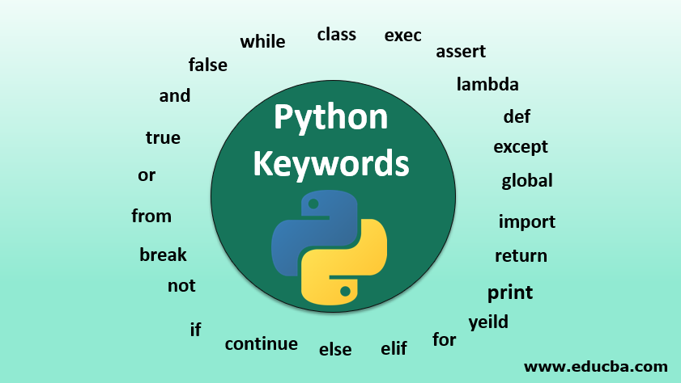

# Python tokens : Keywords, Identifiers, Literals & Operators


# Operators in Python


## Keywords in Python

Python keywords are unique words reserved with defined meanings and functions that we can only apply for those functions. You'll never need to import any keyword into your program because they're permanently present. Assigning a particular meaning to Python keywords means you can't use them for other purposes in our code. You'll get a message of SyntaxError if you attempt to do the same.
Some of the keywords in Python are

<dl>
    
</dl>

```py

import keyword  
print("The set of keywords in this version is: ")  
print(keyword.kwlist)  
```


## Literals in Python

Python Literals can be defined as data that is given in a variable or constant.

Python supports the following literals:

1. String literals:
String literals can be formed by enclosing a text in the quotes. We can use both single as well as double quotes to create a string.

2. Numeric literals:
Numeric Literals are immutable. Numeric literals can belong to following four different numerical types.

3. Boolean literals:
A Boolean literal can have any of the two values: True or False.

4. Special literals.
Python contains one special literal i.e., None.
None is used to specify to that field that is not created. It is also used for the end of lists in Python.

5. Literal Collections.
Python provides the four types of literal collection such as List literals, Tuple literals, Dict literals, and Set literals.

    List:
    
    List contains items of different data types. Lists are mutable i.e., modifiable.
    
    The values stored in List are separated by comma(,) and enclosed within square brackets([]). We can store different types of data in a List.


# Some other data structures in Python

## Sets 
Set is also a type of data structure in python which is similar to list but the key difference is list is mutable whereas set is not a mutable data structure.
```py
set1 = (1, 2, 3, 4, 'Shrish', True)
print(set1)
```


## Lists
Lists in python are similar to arrays in Js. The list can contain data of different types. The item stored in the list are separated with a comma and enclosed within square brackets[].

We can use slice [:] operators to access the data of the list. The concatenation operator (+) and repetition operator (*) works with the list in the same way as they were working with the strings.
